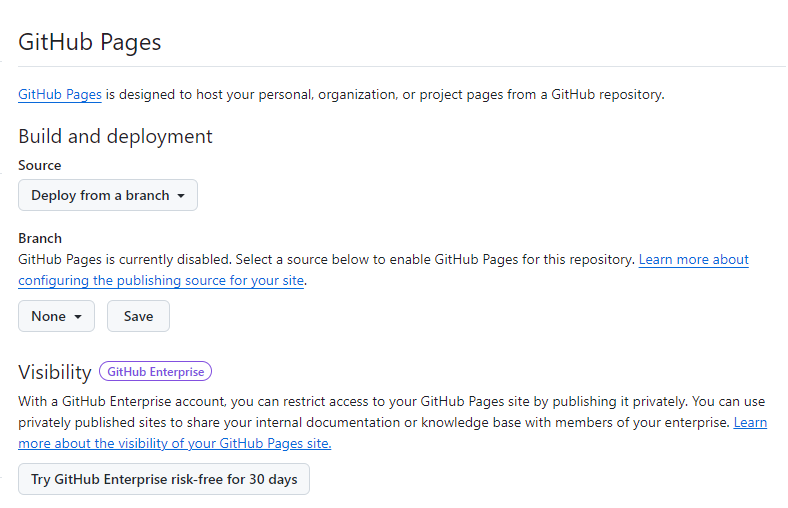

# github pages? 연습

[참조 링크](https://www.youtube.com/watch?v=QyFcl_Fba-k)

## 요약

현재 전제는 index.html이 있는조건이다.

## 순서

Settings > (GitHub) Pages  

(진짜 정적 단순 html파일일경우 github Actions가 필요없는 상황일 것으로추정)  
배포할 branch 설정,/root 설정 필요  
해당 경로에 index.html이 필요할 것으로 추정

설정이 완료됬으면 Save  
빌드에 시간이 소요될 수있음  
일정 시간이 지난후 새로고침 시 링크를 확인할 수 있음

그렇다면 자동으로
[https://kyh012412.github.io/superninja](https://kyh012412.github.io/superninja)가 만들어짐

### a href 연결

`<a href="/contact.html">To contact</a>`를 사용하면 안되고  
`<a href="/SuperNinja/contact.html">To contact</a>` 또는  
`<a href="/${repositoryName}/contact.html">To contact</a>` 이렇게 써줘야 정상적인 연결이 된다.
